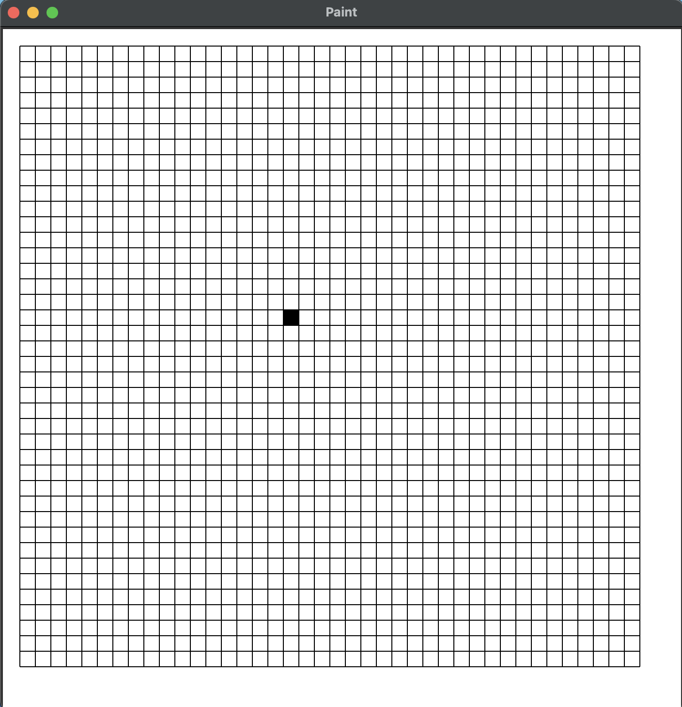
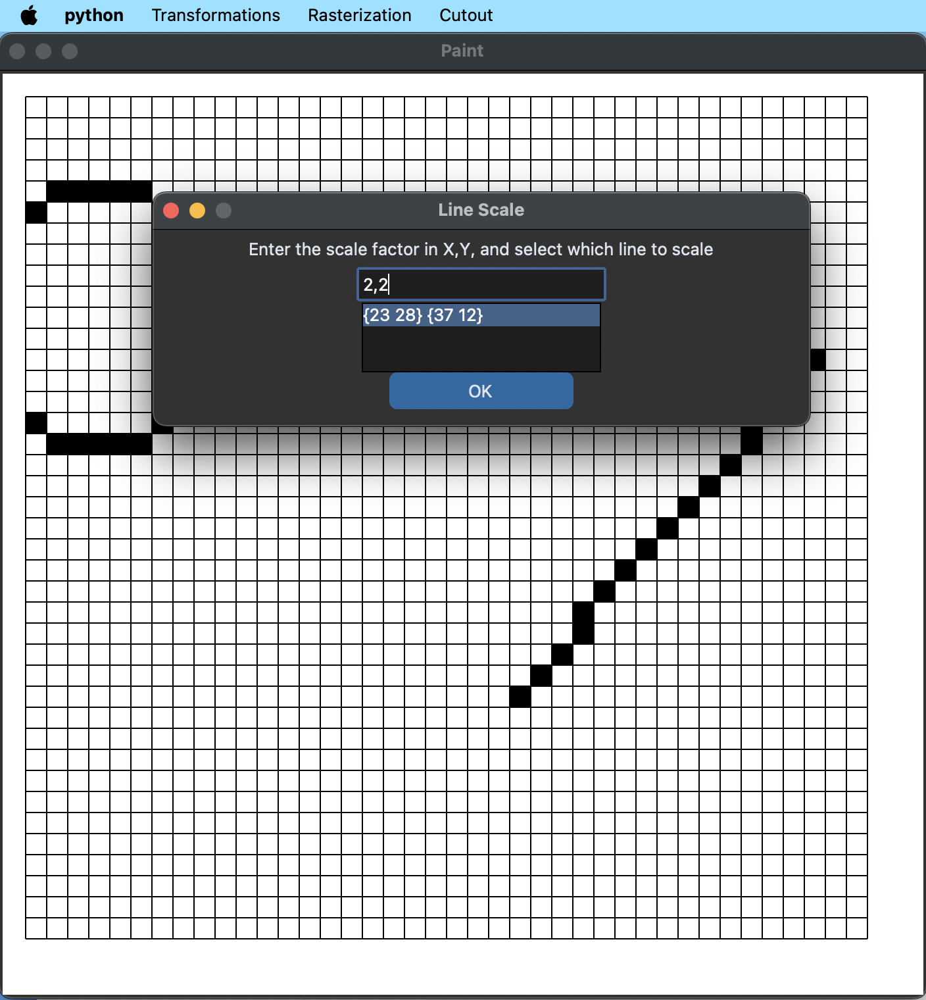

# paint_implementation

## Objectives of the Program

Implement a Paint like program containing the following intens:

### Geometric 2D transformations
```Translation```
```Rotation```
```Scale```
```Reflection X/Y/XY```

### Rasterization
```Lines - DDA, Bresenham```
```Circle - Bresenham```

### Cutout
```Codified Regions - Cohen-Sutherland```
```Parametric equation – Liang-Barsky```

## Files
### main.py
Calls the PaintInterface class.

### paintinterface.py
Contains the PaintInterface class with functions necessary for the visual interface of the program.

``` clear_pixel_matrix ```
Sets the pixels matrix as 0 in all positions and calls the function draw_grid.

``` draw_grid ```
Creates a square on the screen for each point in the range of rows and columns, set them as white if they have 0 as their value in the pixels matrix or black if it is 1. It also draws the lines between squares for better user visualization.

``` color_grid ```
Sets the pixels for the points, lines and circles that were set by the user, then calls the draw_grid function.

``` click ```
Gets the position where the user clicked on the program, transfers it to where in the pixel matrix that would be and then changes the state of that pixel.

``` line_translation ```
Calls the Popup window asking the user the value of the translation in x and y with a listbox containing the lines created by the user. Gets the user inputs and if they are not empty treats them and then calls the functions class for the move function, utililizing it on each of the 2 points of the line. Ends it removing the original line from the line list and inserting the new line and calls the color_grid function.

``` rotation ```
Calls the Popup window asking the user the value of the rotation in degrees with a listbox containing the lines created by the user. Gets the user inputs and if they are not empty treats them, gets the point in the midle of the line chosen, subtracts the middle point from the 2 points from the line chosen so that a cartesian plane is simulated with the midle point as (0,0), rotates both points using the functions class rotate function and then adds the middle point to the points that were rotated as to return to original points system. Ends it removing the original line from the line list and inserting the new line and calls the color_grid function.

``` scale ```
Calls the Popup window asking the user the value of the scale in x and y with a listbox containing the lines created by the user. Gets the user inputs and if they are not empty treats them, gets the point in the midle of the line chosen, subtracts the middle point from the 2 points from the line chosen so that a cartesian plane is simulated with the midle point as (0,0), resizes both points using the functions class resize function and then adds the middle point to the points that were scaled as to return to original points system. Ends it removing the original line from the line list and inserting the new line and calls the color_grid function.

``` reflection_x, reflection_y and reflection_xy ```
Calls the clear_pixel_matrix function, then for every point, line and circle in their respectives lists, reflexes them using the functions class reflex function and then saves them into new lists that then substitute the original ones. Ends it by calling the color_grid function.

``` dda ```
Gets the last 2 points that the user clicked and calls the functions class dda function using them as arguments and adds them to the lines list. Then for each point returned turns them to 1 in the pixels matrix, then removes the 2 points from the points list as they are now from the line. Ends it by calling the color_grid function.

``` bresenham ```
Gets the last 2 points that the user clicked and calls the functions class bres function using them as arguments and adds them to the lines list. Then for each point returned turns them to 1 in the pixels matrix, then removes the 2 points from the points list as they are now from the line. Ends it by calling the color_grid function.

``` circle ```
Gets the last 2 points that the user clicked and gets what is the distance between them using the functions class distance function followed by calling the functions class bres function using the first point and the distance as arguments. Adds the 2 points to the circles list. Then for each point returned turns them to 1 in the pixels matrix, then removes the 2 points from the points list as they are now from the line. Ends it by calling the color_grid function.

``` cohen_sutherland ```
Gets the last 2 points that the user clicked and checks which x and which y in bigger (as to simulate an invisible rectangle) then for each line in the lines list calls the class functions cohen_sutherland function. If a line is returned by the function adds it to a new lines list. Then removes the 2 points from the points list as they were only used for the square. Then it ends by calling the color_grid function with the new lines list as an argument as to draw the lines that are limited by the invisible square temporarily.

``` liang_barsky ```
ets the last 2 points that the user clicked and checks which x and which y in bigger (as to simulate an invisible rectangle) then for each line in the lines list calls the class functions liang_barsky function. If a line is returned by the function adds it to a new lines list. Then removes the 2 points from the points list as they were only used for the square. Then it ends by calling the color_grid function with the new lines list as an argument as to draw the lines that are limited by the invisible square temporarily.

### utils.functions.py
Contains the logic of the program, with the implementation of the objectives of this project that were given by the teacher.

### utils.popupwindow.py
Creates a popup window that has a title, a message for the user, an input box, a button and can have a list box.

``` close ```
Saves the user input and closes the popup window.

``` get_listbox_selection ```
Gets the value the user chosen in the listbox. It is used only in the popupwindow program.

``` get_user_input ```
Returns the user input in the input box and if the window has a listbox returns as well what the user chose in it.

### utils.settings.py
Contains the constants necessary for the program.

## How to Use

### Module Installation / Setup

```git clone <repo-url>```

```cd <repo-folder>```

```pip install -r requirements.txt```

or

```pip3 install -r requirements.txt```

or

```python - m pip install -r requirements.txt```

or

```python3 -m pip install -r requirements.txt```

### Running the Program

```python main.py```

or

```python3 main.py```

### Initial view

After starting the program, the user can click on the squares to color them, or if they are already colored to erase the color.



These are the menus available for the user:

### Transformations menu


### Rasterization menu


### Cutout menu


### Make a Line


Both these buttons will result in a line with the limits being the last two point clicked.


### Make a Circle

After making 2 new points the user can press the circle button to make a circle.


### Move a Line


### Rotate a Line


### Scale a Line




### Reflect the drawings


### Cut the lines
The user clicks on two points to select the area (as a rectangle) that should have lines cut.


